# Programming with C#
## Installing Visual Studio Community
Download and install Visual Studio Community Edition from [here](https://visualstudio.microsoft.com/).
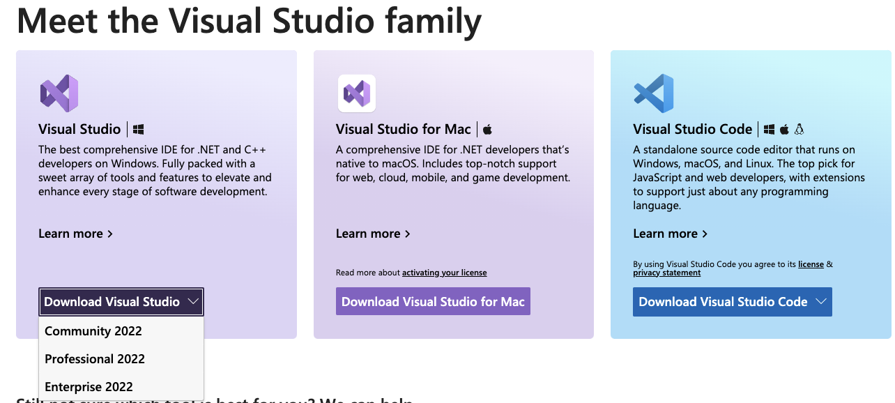

Follow the instructions in the installer to setup VS2022 in your local machine. Once installed, launch VS2022.

__Note for Mac Users: VS 2022 is also available for Mac. Download the DMG and install it in your local.__
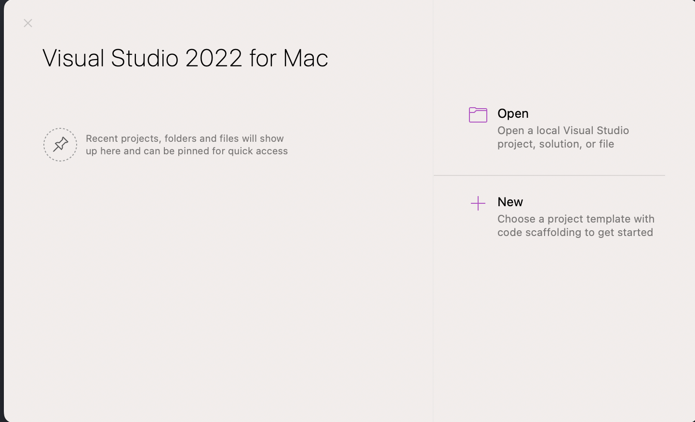

In addition, Mac Users will also have to install .NET Core 5.0. Download and install the package from [here](https://dotnet.microsoft.com/en-us/download/dotnet/thank-you/sdk-5.0.408-macos-x64-installer).

### Windows Users
After launching VS2022 installer, you should see the following screen:
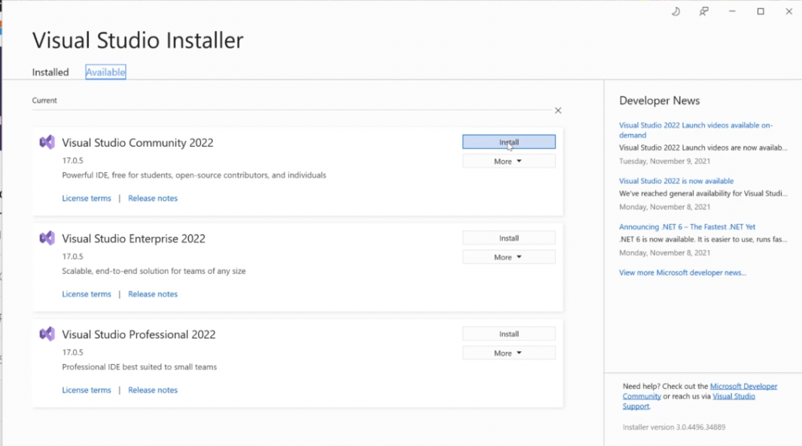


Here, click on `Install` next to `Visual Studio Community 2022`.

Select the following in the `Workloads` tab:

- .NET desktop development

Other than the defaults in `Individual Components`, select the following as well:
- .NET 5.0 Runtime

__Note that the .NET 5.0 is End of support as of May 10, 2022. Also make sure that .NET 6.0 is selected.__


Next, click on `Install` and the bottom right and wait for the installation to finish.

Once the installation is done, you'll be asked to `Sign In`. Use an existing account or create a new one. Next, customize the look and feel for your Visual Studio.

## Hello World!
### Windows
Let's create a new project in Visual Studio 2022 and select `Create a new Project`.
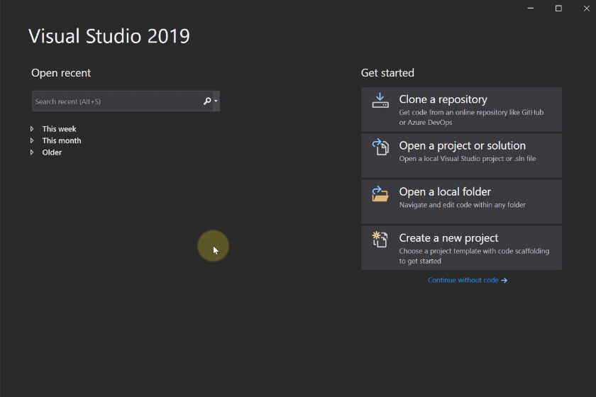

Next, select the template as `Console Application` for C# (not VB) and click `Next`.
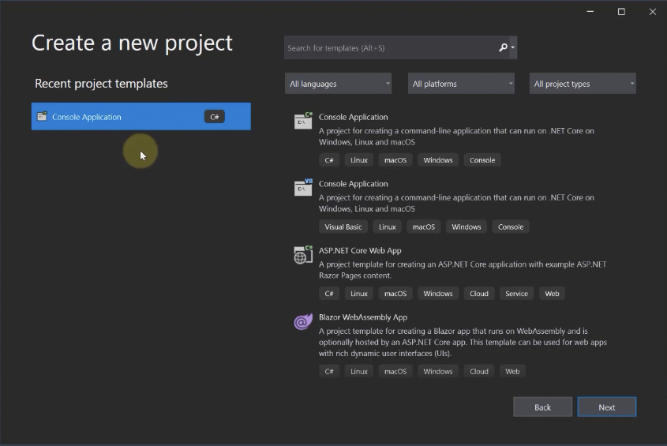

Select the target framework as `.NET 5.0` and click `Create`.

Once the project creation completes, you should see the Solution open in VS 2022 with the files showing in the `Solution Explorer`.
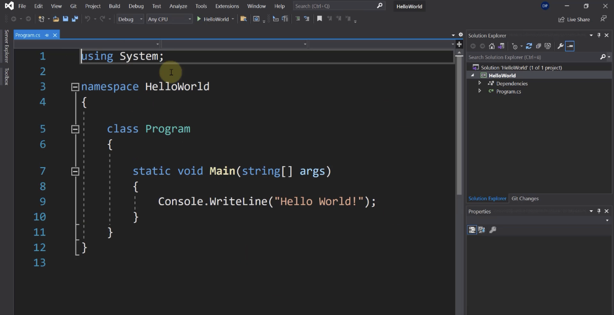


If you open the project in `Explorer`, you'll notice that there is a file that ends in the extension `.sln`. This is the solution file for your project.
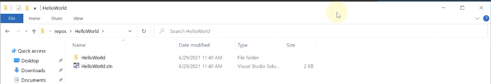


### Mac Users
Open VS 2022 and click on `New`:
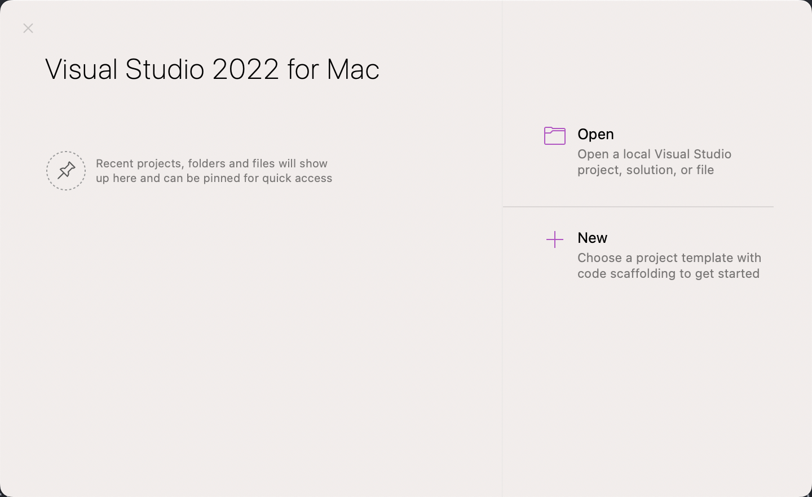

In the Wizard, select `Console Application` under `General` and the programming language as C#.
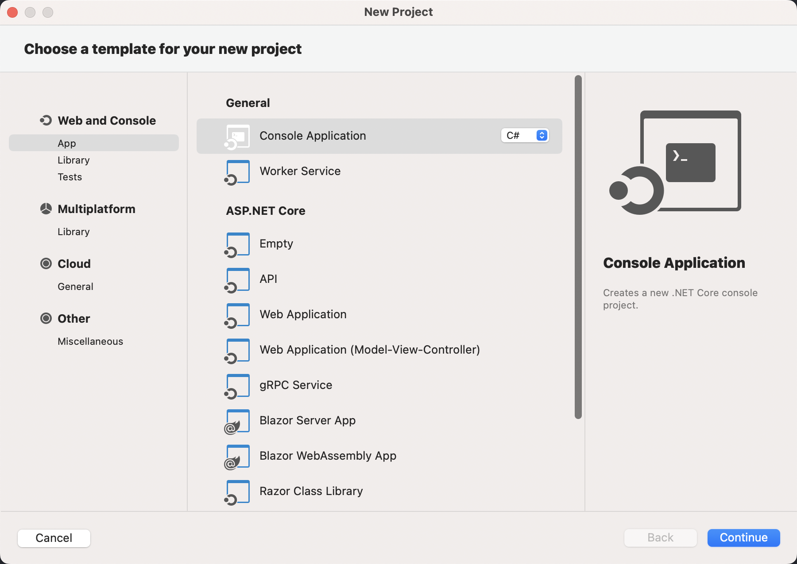

Next, select the target framework as .NET 6.0 and click on `Continue`.
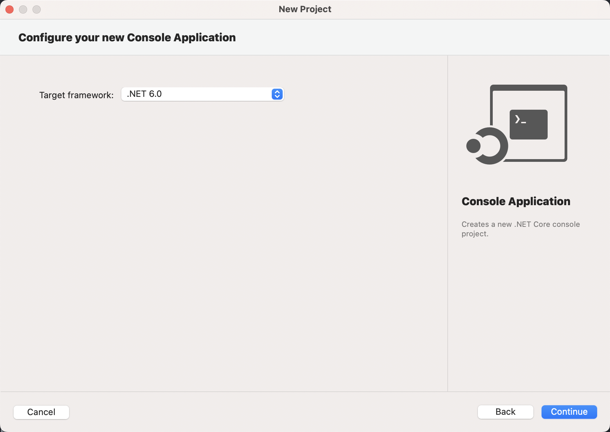

Provide the following input on the next screen:

- Project Name: `Hello_World`


Click on `Create` and wait for the project to load in VS 2022. You should see the following in VS 2022 window:
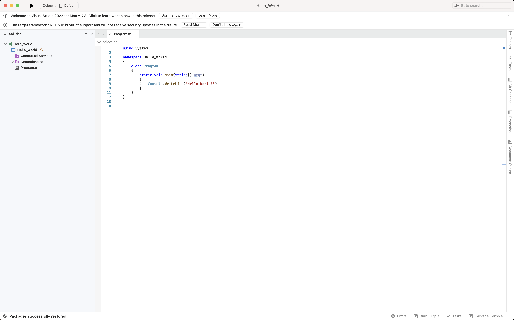


### Deep Dive into the Hello World
The "Hello, World" program starts with a `using` directive that references the `System` namespace. Namespaces provide a hierarchical means of organizing C# programs and libraries. Namespaces contain types and other namespaces—for example, the `System` namespace contains a number of types, such as the `Console` class referenced in the program, and a number of other namespaces, such as `IO` and `Collections`. A `using` directive that references a given namespace enables unqualified use of the types that are members of that namespace. Because of the `using` directive, the program can use `Console.WriteLine` as shorthand for `System.Console.WriteLine`.

The `Hello` class declared by the "Hello, World" program has a single member, the method named Main. The `Main` method is declared with the `static` modifier. While instance methods can reference a particular enclosing object instance using the keyword this, static methods operate without reference to a particular object. By convention, a `static` method named Main serves as the entry point of a C# program.

The output of the program is produced by the `WriteLine` method of the `Console` class in the `System` namespace. This class is provided by the standard class libraries, which, by default, are automatically referenced by the compiler.


## DataTypes and Variables
A type defines the structure and behavior of any data in C#. The declaration of a type may include its members, base type, interfaces it implements, and operations permitted for that type. A variable is a label that refers to an instance of a specific type.

There are two kinds of types in C#: value types and reference types. Variables of value types directly contain their data. Variables of reference types store references to their data, the latter being known as objects. With reference types, it's possible for two variables to reference the same object and possible for operations on one variable to affect the object referenced by the other variable. With value types, the variables each have their own copy of the data, and it isn't possible for operations on one to affect the other (except for `ref` and `out` parameter variables).

An `identifier` is a variable name. An identifier is a sequence of unicode characters without any whitespace. An identifier may be a C# reserved word, if it's prefixed by @. Using a reserved word as an identifier can be useful when interacting with other languages.

C#'s value types are further divided into simple types, enum types, struct types, nullable value types, and tuple value types. C#'s reference types are further divided into class types, interface types, array types, and delegate types.


The following outline provides an overview of C#'s type system.

### Value Types
Value types and reference types are the two main categories of C# types. A variable of a value type contains an instance of the type. This differs from a variable of a reference type, which contains a reference to an instance of the type. By default, on assignment, passing an argument to a method, and returning a method result, variable values are copied. In the case of value-type variables, the corresponding type instances are copied. The following example demonstrates that behavior:

```
using System;

public struct MutablePoint
{
    public int X;
    public int Y;

    public MutablePoint(int x, int y) => (X, Y) = (x, y);

    public override string ToString() => $"({X}, {Y})";
}

public class Program
{
    public static void Main()
    {
        var p1 = new MutablePoint(1, 2);
        var p2 = p1;
        p2.Y = 200;
        Console.WriteLine($"{nameof(p1)} after {nameof(p2)} is modified: {p1}");
        Console.WriteLine($"{nameof(p2)}: {p2}");

        MutateAndDisplay(p2);
        Console.WriteLine($"{nameof(p2)} after passing to a method: {p2}");
    }

    private static void MutateAndDisplay(MutablePoint p)
    {
        p.X = 100;
        Console.WriteLine($"Point mutated in a method: {p}");
    }
}
// Expected output:
// p1 after p2 is modified: (1, 2)
// p2: (1, 200)
// Point mutated in a method: (100, 200)
// p2 after passing to a method: (1, 200)
```

As the preceding example shows, operations on a value-type variable affect only that instance of the value type, stored in the variable.

If a value type contains a data member of a reference type, only the reference to the instance of the reference type is copied when a value-type instance is copied. Both the copy and original value-type instance have access to the same reference-type instance. The following example demonstrates that behavior:

```
using System;
using System.Collections.Generic;

public struct TaggedInteger
{
    public int Number;
    private List<string> tags;

    public TaggedInteger(int n)
    {
        Number = n;
        tags = new List<string>();
    }

    public void AddTag(string tag) => tags.Add(tag);

    public override string ToString() => $"{Number} [{string.Join(", ", tags)}]";
}

public class Program
{
    public static void Main()
    {
        var n1 = new TaggedInteger(0);
        n1.AddTag("A");
        Console.WriteLine(n1);  // output: 0 [A]

        var n2 = n1;
        n2.Number = 7;
        n2.AddTag("B");

        Console.WriteLine(n1);  // output: 0 [A, B]
        Console.WriteLine(n2);  // output: 7 [A, B]
    }
}
```

__Note: To make your code less error-prone and more robust, define and use immutable value types.__

#### Integral types
C# supports the following predefined integral types:
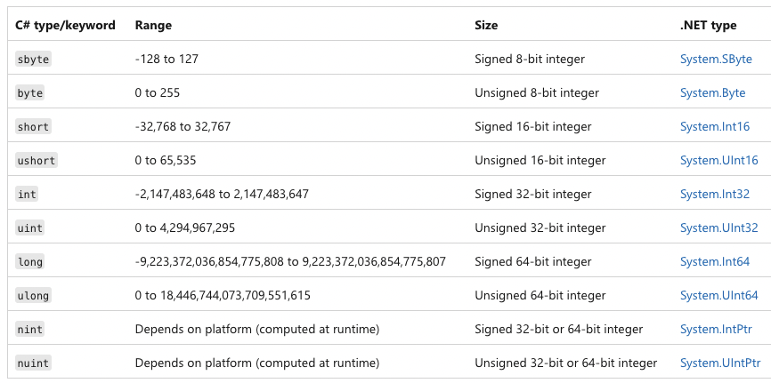

##### Integer literals

Integer literals can be

- decimal: without any prefix
- hexadecimal: with the 0x or 0X prefix
- binary: with the 0b or 0B prefix

```
var decimalLiteral = 42;
var hexLiteral = 0x2A;
var binaryLiteral = 0b_0010_1010;
```

The type of an integer literal is determined by its suffix as follows:

- If the literal has no suffix, its type is the first of the following types in which its value can be represented: int, uint, long, ulong.
- If the literal is suffixed by U or u, its type is the first of the following types in which its value can be represented: uint, ulong.
- If the literal is suffixed by UL, Ul, uL, ul, LU, Lu, lU, or lu, its type is ulong
- If the literal is suffixed by L or l, its type is the first of the following types in which its value can be represented: long, ulong.

#### Floating-point Types
C# supports the following predefined floating-point types:

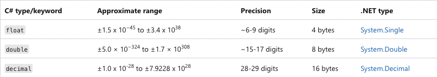

In the preceding table, each C# type keyword from the leftmost column is an alias for the corresponding .NET type. They are interchangeable. For example, the following declarations declare variables of the same type:

```
double a = 12.3;
System.Double b = 12.3;
```

The default value of each floating-point type is zero, 0. Each of the floating-point types has the MinValue and MaxValue constants that provide the minimum and maximum finite value of that type. The float and double types also provide constants that represent not-a-number and infinity values. For example, the double type provides the following constants: Double.NaN, Double.NegativeInfinity, and Double.PositiveInfinity.

### The string type
The string type represents a sequence of zero or more Unicode characters. string is an alias for System.String in .NET.

Although string is a reference type, the equality operators == and != are defined to compare the values of string objects, not references. Value based equality makes testing for string equality more intuitive. For example:

```
string a = "hello";
string b = "h";
// Append to contents of 'b'
b += "ello";
Console.WriteLine(a == b);
Console.WriteLine(object.ReferenceEquals(a, b));
```

The previous example displays "True" and then "False" because the content of the strings is equivalent, but a and b don't refer to the same string instance.

The + operator concatenates strings:

```
string a = "good " + "morning";
```

The preceding code creates a string object that contains "good morning".

Strings are immutable--the contents of a string object can't be changed after the object is created. For example, when you write this code, the compiler actually creates a new string object to hold the new sequence of characters, and that new object is assigned to b. The memory that had been allocated for b (when it contained the string "h") is then eligible for garbage collection.


```
string b = "h";
b += "ello";
```

The [] operator can be used for readonly access to individual characters of a string. Valid index values start at 0 and must be less than the length of the string:


```
string str = "test";
char x = str[2];  // x = 's';
```

#### String literals

String literals are of type string and can be written in three forms, raw, quoted, and verbatim.

Raw string literals are available beginning in C# 11. Raw string literals can contain arbitrary text without requiring escape sequences. Raw string literals can include whitespace and new lines, embedded quotes, and other special characters. Raw string literals are enclosed in a minimum of three double quotation marks ("""):

```
"""
This is a multi-line
    string literal with the second line indented.
"""
```


Raw string literals typically have the starting and ending quote sequences on separate lines from the embedded text. Multiline raw string literals support strings that are themselves quoted strings:


```
var message = """
"This is a very important message."
""";
Console.WriteLine(message);
// output: "This is a very important message."
```


When the starting and ending quotes are on separate lines, the newlines following the opening quote and preceding the ending quote aren't included in the final content. The closing quote sequence dictates the leftmost column for the string literal. You can indent a raw string literal to match the overall code format:

```
var message = """
    "This is a very important message."
    """;
Console.WriteLine(message);
// output: "This is a very important message."
// The leftmost whitespace is not part of the raw string literal
```

Verbatim string literals start with @ and are also enclosed in double quotation marks. For example:
```
@"good morning"  // a string literal
```

The advantage of verbatim strings is that escape sequences aren't processed, which makes it easy to write. For example, the following text matches a fully qualified Windows file name:

```
@"c:\Docs\Source\a.txt"  // rather than "c:\\Docs\\Source\\a.txt"

```


### Coding Standards

Ref: https://learn.microsoft.com/en-us/dotnet/csharp/fundamentals/coding-style/coding-conventions

### Value vs reference types

Ref: https://www.tutorialsteacher.com/csharp/csharp-value-type-and-reference-type

### Console Methods

Ref: https://learn.microsoft.com/en-us/dotnet/api/system.console.writeline?view=netcore-3.1#System_Console_WriteLine_System_String_

### Challenges
#### Challenge 1 – String and its methods

Now you know the use of various string functions so let’s create a small Console application to practice this.

Declare a string variable and don’t assign any value to it.

Print on the console “Please enter your name and press enter”. You can then enter your name or any other valid string like “tutorials.eu”.

Assign that entered string to the string variable which you have declared initially.

The program should write on the console that string in Uppercase in the first line, then the same string in Lowercase in the second line. In the third line, it writes on the console the string with no trailing or preceding white space like if string entered as “ tutorials.eu ” it should be written on the console as “tutorials.eu”. And in the last line, it should write the Substring of the entered string on the console.

These kinds of features are e.g. used when creating a login screen, where the system will cut out trailing or preceding white space or, doesn’t care about the casing of the entered username.

#### Challenge String and its methods 2

Let’s create another console application for more practice.

This application asks the user to input a string in the first line like “Enter a string here: ”.

In the Second Line, it should ask for the character to search in the string which you have entered in the first line like “Enter the character to search: ”

On the third line, it should write the index of the first occurrence of the searched character from the string.

Now on concatenation...

It should then ask to enter the first name and once the name is written and the enter button is pressed, it should ask to enter the last name.

It should then show your full name printed in a single line like in my case the output will be "Denis Panjuta". Output can be different in your case. Try to store the full name in a variable, before displaying it.
