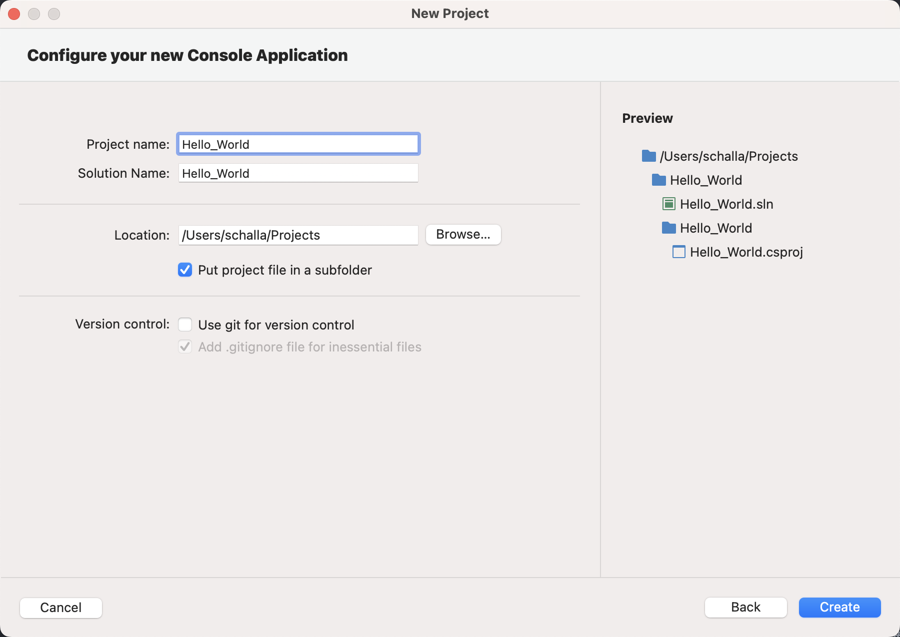

# Programming with C#
## Installing Visual Studio Community
Download and install Visual Studio Community Edition from [here](https://visualstudio.microsoft.com/).


Follow the instructions in the installer to setup VS2022 in your local machine. Once installed, launch VS2022.

__Note for Mac Users: VS 2022 is also available for Mac. Download the DMG and install it in your local.__


In addition, Mac Users will also have to install .NET Core 5.0. Download and install the package from [here](https://dotnet.microsoft.com/en-us/download/dotnet/thank-you/sdk-5.0.408-macos-x64-installer).

### Windows Users
After launching VS2022 installer, you should see the following screen:


Here, click on `Install` next to `Visual Studio Community 2022`.

Select the following in the `Workloads` tab:

- .NET desktop development

Other than the defaults in `Individual Components`, select the following as well:
- .NET 5.0 Runtime

__Note that the .NET 5.0 is End of support as of May 10, 2022. Also make sure that .NET 6.0 is selected.__


Next, click on `Install` and the bottom right and wait for the installation to finish.

Once the installation is done, you'll be asked to `Sign In`. Use an existing account or create a new one. Next, customize the look and feel for your Visual Studio.

## Hello World!
### Windows
Let's create a new project in Visual Studio 2022 and select `Create a new Project`.


Next, select the template as `Console Application` for C# (not VB) and click `Next`.


Select the target framework as `.NET 5.0` and click `Create`.

Once the project creation completes, you should see the Solution open in VS 2022 with the files showing in the `Solution Explorer`.


If you open the project in `Explorer`, you'll notice that there is a file that ends in the extension `.sln`. This is the solution file for your project.


### Mac Users
Open VS 2022 and click on `New`:


In the Wizard, select `Console Application` under `General` and the programming language as C#.


Next, select the target framework as .NET 6.0 and click on `Continue`.


Provide the following input on the next screen:

- Project Name: `Hello_World`


Click on `Create` and wait for the project to load in VS 2022. You should see the following in VS 2022 window:


### Deep Dive into the Hello World
The "Hello, World" program starts with a `using` directive that references the `System` namespace. Namespaces provide a hierarchical means of organizing C# programs and libraries. Namespaces contain types and other namespaces—for example, the `System` namespace contains a number of types, such as the `Console` class referenced in the program, and a number of other namespaces, such as `IO` and `Collections`. A `using` directive that references a given namespace enables unqualified use of the types that are members of that namespace. Because of the `using` directive, the program can use `Console.WriteLine` as shorthand for `System.Console.WriteLine`.

The `Hello` class declared by the "Hello, World" program has a single member, the method named Main. The `Main` method is declared with the `static` modifier. While instance methods can reference a particular enclosing object instance using the keyword this, static methods operate without reference to a particular object. By convention, a `static` method named Main serves as the entry point of a C# program.

The output of the program is produced by the `WriteLine` method of the `Console` class in the `System` namespace. This class is provided by the standard class libraries, which, by default, are automatically referenced by the compiler.


## DataTypes and Variables
A type defines the structure and behavior of any data in C#. The declaration of a type may include its members, base type, interfaces it implements, and operations permitted for that type. A variable is a label that refers to an instance of a specific type.

There are two kinds of types in C#: value types and reference types. Variables of value types directly contain their data. Variables of reference types store references to their data, the latter being known as objects. With reference types, it's possible for two variables to reference the same object and possible for operations on one variable to affect the object referenced by the other variable. With value types, the variables each have their own copy of the data, and it isn't possible for operations on one to affect the other (except for `ref` and `out` parameter variables).

An `identifier` is a variable name. An identifier is a sequence of unicode characters without any whitespace. An identifier may be a C# reserved word, if it's prefixed by @. Using a reserved word as an identifier can be useful when interacting with other languages.

C#'s value types are further divided into simple types, enum types, struct types, nullable value types, and tuple value types. C#'s reference types are further divided into class types, interface types, array types, and delegate types.


The following outline provides an overview of C#'s type system.

### Value Types
Value types and reference types are the two main categories of C# types. A variable of a value type contains an instance of the type. This differs from a variable of a reference type, which contains a reference to an instance of the type. By default, on assignment, passing an argument to a method, and returning a method result, variable values are copied. In the case of value-type variables, the corresponding type instances are copied. The following example demonstrates that behavior:

```
using System;

public struct MutablePoint
{
    public int X;
    public int Y;

    public MutablePoint(int x, int y) => (X, Y) = (x, y);

    public override string ToString() => $"({X}, {Y})";
}

public class Program
{
    public static void Main()
    {
        var p1 = new MutablePoint(1, 2);
        var p2 = p1;
        p2.Y = 200;
        Console.WriteLine($"{nameof(p1)} after {nameof(p2)} is modified: {p1}");
        Console.WriteLine($"{nameof(p2)}: {p2}");

        MutateAndDisplay(p2);
        Console.WriteLine($"{nameof(p2)} after passing to a method: {p2}");
    }

    private static void MutateAndDisplay(MutablePoint p)
    {
        p.X = 100;
        Console.WriteLine($"Point mutated in a method: {p}");
    }
}
// Expected output:
// p1 after p2 is modified: (1, 2)
// p2: (1, 200)
// Point mutated in a method: (100, 200)
// p2 after passing to a method: (1, 200)
```

As the preceding example shows, operations on a value-type variable affect only that instance of the value type, stored in the variable.

If a value type contains a data member of a reference type, only the reference to the instance of the reference type is copied when a value-type instance is copied. Both the copy and original value-type instance have access to the same reference-type instance. The following example demonstrates that behavior:

```
using System;
using System.Collections.Generic;

public struct TaggedInteger
{
    public int Number;
    private List<string> tags;

    public TaggedInteger(int n)
    {
        Number = n;
        tags = new List<string>();
    }

    public void AddTag(string tag) => tags.Add(tag);

    public override string ToString() => $"{Number} [{string.Join(", ", tags)}]";
}

public class Program
{
    public static void Main()
    {
        var n1 = new TaggedInteger(0);
        n1.AddTag("A");
        Console.WriteLine(n1);  // output: 0 [A]

        var n2 = n1;
        n2.Number = 7;
        n2.AddTag("B");

        Console.WriteLine(n1);  // output: 0 [A, B]
        Console.WriteLine(n2);  // output: 7 [A, B]
    }
}
```

__Note: To make your code less error-prone and more robust, define and use immutable value types.__

#### Integral types
C# supports the following predefined integral types:


##### Integer literals

Integer literals can be

- decimal: without any prefix
- hexadecimal: with the 0x or 0X prefix
- binary: with the 0b or 0B prefix

```
var decimalLiteral = 42;
var hexLiteral = 0x2A;
var binaryLiteral = 0b_0010_1010;
```

The type of an integer literal is determined by its suffix as follows:

- If the literal has no suffix, its type is the first of the following types in which its value can be represented: int, uint, long, ulong.
- If the literal is suffixed by U or u, its type is the first of the following types in which its value can be represented: uint, ulong.
- If the literal is suffixed by UL, Ul, uL, ul, LU, Lu, lU, or lu, its type is ulong
- If the literal is suffixed by L or l, its type is the first of the following types in which its value can be represented: long, ulong.

#### Floating-point Types
C# supports the following predefined floating-point types:


In the preceding table, each C# type keyword from the leftmost column is an alias for the corresponding .NET type. They are interchangeable. For example, the following declarations declare variables of the same type:

```
double a = 12.3;
System.Double b = 12.3;
```

The default value of each floating-point type is zero, 0. Each of the floating-point types has the MinValue and MaxValue constants that provide the minimum and maximum finite value of that type. The float and double types also provide constants that represent not-a-number and infinity values. For example, the double type provides the following constants: Double.NaN, Double.NegativeInfinity, and Double.PositiveInfinity.

### The string type
The string type represents a sequence of zero or more Unicode characters. string is an alias for System.String in .NET.

Although string is a reference type, the equality operators == and != are defined to compare the values of string objects, not references. Value based equality makes testing for string equality more intuitive. For example:

```
string a = "hello";
string b = "h";
// Append to contents of 'b'
b += "ello";
Console.WriteLine(a == b);
Console.WriteLine(object.ReferenceEquals(a, b));
```

The previous example displays "True" and then "False" because the content of the strings is equivalent, but a and b don't refer to the same string instance.

The + operator concatenates strings:

```
string a = "good " + "morning";
```

The preceding code creates a string object that contains "good morning".

Strings are immutable--the contents of a string object can't be changed after the object is created. For example, when you write this code, the compiler actually creates a new string object to hold the new sequence of characters, and that new object is assigned to b. The memory that had been allocated for b (when it contained the string "h") is then eligible for garbage collection.


```
string b = "h";
b += "ello";
```

The [] operator can be used for readonly access to individual characters of a string. Valid index values start at 0 and must be less than the length of the string:


```
string str = "test";
char x = str[2];  // x = 's';
```

#### Creating a String object
You can create string object using one of the following methods −

- By assigning a string literal to a String variable
- By using a String class constructor
- By using the string concatenation operator (+)
- By retrieving a property or calling a method that returns a string
- By calling a formatting method to convert a value or an object to its string representation

The following example demonstrates this −
```
using System;

namespace StringApplication {

   class Program {

      static void Main(string[] args) {
         //from string literal and string concatenation
         string fname, lname;
         fname = "Rowan";
         lname = "Atkinson";

         char []letters= { 'H', 'e', 'l', 'l','o' };
         string [] sarray={ "Hello", "From", "Tutorials", "Point" };

         string fullname = fname + lname;
         Console.WriteLine("Full Name: {0}", fullname);

         //by using string constructor { 'H', 'e', 'l', 'l','o' };
         string greetings = new string(letters);
         Console.WriteLine("Greetings: {0}", greetings);

         //methods returning string { "Hello", "From", "Tutorials", "Point" };
         string message = String.Join(" ", sarray);
         Console.WriteLine("Message: {0}", message);

         //formatting method to convert a value
         DateTime waiting = new DateTime(2012, 10, 10, 17, 58, 1);
         string chat = String.Format("Message sent at {0:t} on {0:D}", waiting);
         Console.WriteLine("Message: {0}", chat);
      }
   }
}
```

When the above code is compiled and executed, it produces the following result −

```
Full Name: RowanAtkinson
Greetings: Hello
Message: Hello From Tutorials Point
Message: Message sent at 5:58 PM on Wednesday, October 10, 2012
```


#### String literals

String literals are of type string and can be written in three forms, raw, quoted, and verbatim.

Raw string literals are available beginning in C# 11. Raw string literals can contain arbitrary text without requiring escape sequences. Raw string literals can include whitespace and new lines, embedded quotes, and other special characters. Raw string literals are enclosed in a minimum of three double quotation marks ("""):

```
"""
This is a multi-line
    string literal with the second line indented.
"""
```


Raw string literals typically have the starting and ending quote sequences on separate lines from the embedded text. Multiline raw string literals support strings that are themselves quoted strings:


```
var message = """
"This is a very important message."
""";
Console.WriteLine(message);
// output: "This is a very important message."
```


When the starting and ending quotes are on separate lines, the newlines following the opening quote and preceding the ending quote aren't included in the final content. The closing quote sequence dictates the leftmost column for the string literal. You can indent a raw string literal to match the overall code format:

```
var message = """
    "This is a very important message."
    """;
Console.WriteLine(message);
// output: "This is a very important message."
// The leftmost whitespace is not part of the raw string literal
```

Verbatim string literals start with @ and are also enclosed in double quotation marks. For example:
```
@"good morning"  // a string literal
```

The advantage of verbatim strings is that escape sequences aren't processed, which makes it easy to write. For example, the following text matches a fully qualified Windows file name:

```
@"c:\Docs\Source\a.txt"  // rather than "c:\\Docs\\Source\\a.txt"

```

#### Properties of the String Class
The String class has the following two properties −

| Sr.No | Property and Description |
|----|----|
| 1   |  Chars: Gets the Char object at a specified position in the current String object. |
| 2   | Length: Gets the number of characters in the current String object.   |


#### Methods of the String class
The String class has numerous methods that help you in working with the string objects. The following table provides some of the most commonly used methods −

| **Sr.No.** | **Methods &amp; Description**                                                                                                                                                                                                                                               |
|:----------:|:---------------------------------------------------------------------------------------------------------------------------------------------------------------------------------------------------------------------------------------------------------------------------:|
| **1**      | public static int Compare(string strA, string strB)
Compares two specified string objects and returns an integer that indicates their relative position in the sort order.                                                                                                  |
| **2**      | public static int Compare(string strA, string strB, bool ignoreCase )
Compares two specified string objects and returns an integer that indicates their relative position in the sort order. However, it ignores case if the Boolean parameter is true.
                    |
| **3**      | public static string Concat(string str0, string str1)
Concatenates two string objects.
                                                                                                                                                                                     |
| **4**      | public static string Concat(string str0, string str1, string str2)
Concatenates three string objects.
                                                                                                                                                                      |
| **5**      | public static string Concat(string str0, string str1, string str2, string str3)
Concatenates four string objects.
                                                                                                                                                          |
| **6**      | public bool Contains(string value)
Returns a value indicating whether the specified String object occurs within this string.                                                                                                                                                |
| **7**      | public static string Copy(string str)
Creates a new String object with the same value as the specified string.
                                                                                                                                                             |
| **8**      | public void CopyTo(int sourceIndex, char[] destination, int destinationIndex, int count)
Copies a specified number of characters from a specified position of the String object to a specified position in an array of Unicode characters.                                  |
| **9**      | public bool EndsWith(string value)
Determines whether the end of the string object matches the specified string.
                                                                                                                                                           |
| **10**     | public bool Equals(string value)
Determines whether the current String object and the specified String object have the same value.
                                                                                                                                         |
| **11**     | public static bool Equals(string a, string b)
Determines whether two specified String objects have the same value.
                                                                                                                                                         |
| **12**     | public static string Format(string format, Object arg0)
Replaces one or more format items in a specified string with the string representation of a specified object.
                                                                                                      |
| **13**     | public int IndexOf(char value)
Returns the zero-based index of the first occurrence of the specified Unicode character in the current string.
                                                                                                                              |
| **14**     | public int IndexOf(string value)
Returns the zero-based index of the first occurrence of the specified string in this instance.
                                                                                                                                            |
| **15**     | public int IndexOf(char value, int startIndex)
Returns the zero-based index of the first occurrence of the specified Unicode character in this string, starting search at the specified character position.
                                                                |
| **16**     | public int IndexOf(string value, int startIndex)
Returns the zero-based index of the first occurrence of the specified string in this instance, starting search at the specified character position.
                                                                       |
| **17**     | public int IndexOfAny(char[] anyOf)
Returns the zero-based index of the first occurrence in this instance of any character in a specified array of Unicode characters.
                                                                                                     |
| **18**     | public int IndexOfAny(char[] anyOf, int startIndex)
Returns the zero-based index of the first occurrence in this instance of any character in a specified array of Unicode characters, starting search at the specified character position.
                                |
| **19**     | public string Insert(int startIndex, string value)
Returns a new string in which a specified string is inserted at a specified index position in the current string object.
                                                                                                |
| **20**     | public static bool IsNullOrEmpty(string value)
Indicates whether the specified string is null or an Empty string.
                                                                                                                                                          |
| **21**     | public static string Join(string separator, params string[] value)
Concatenates all the elements of a string array, using the specified separator between each element.
                                                                                                    |
| **22**     | public static string Join(string separator, string[] value, int startIndex, int count)
Concatenates the specified elements of a string array, using the specified separator between each element.
                                                                          |
| **23**     | public int LastIndexOf(char value)
Returns the zero-based index position of the last occurrence of the specified Unicode character within the current string object.
                                                                                                       |
| **24**     | public int LastIndexOf(string value)
Returns the zero-based index position of the last occurrence of a specified string within the current string object.
                                                                                                                  |
| **25**     | public string Remove(int startIndex)
Removes all the characters in the current instance, beginning at a specified position and continuing through the last position, and returns the string.
                                                                               |
| **26**     | public string Remove(int startIndex, int count)
Removes the specified number of characters in the current string beginning at a specified position and returns the string.
                                                                                                 |
| **27**     | public string Replace(char oldChar, char newChar)
Replaces all occurrences of a specified Unicode character in the current string object with the specified Unicode character and returns the new string.
                                                                  |
| **28**     | public string Replace(string oldValue, string newValue)
Replaces all occurrences of a specified string in the current string object with the specified string and returns the new string.
                                                                                  |
| **29**     | public string[] Split(params char[] separator)
Returns a string array that contains the substrings in the current string object, delimited by elements of a specified Unicode character array.
                                                                             |
| **30**     | public string[] Split(char[] separator, int count)
Returns a string array that contains the substrings in the current string object, delimited by elements of a specified Unicode character array. The int parameter specifies the maximum number of substrings to return.
 |
| **31**     | public bool StartsWith(string value)
Determines whether the beginning of this string instance matches the specified string.                                                                                                                                                 |
| **32**     | public char[] ToCharArray()
Returns a Unicode character array with all the characters in the current string object.
                                                                                                                                                        |
| **33**     | public char[] ToCharArray(int startIndex, int length)
Returns a Unicode character array with all the characters in the current string object, starting from the specified index and up to the specified length.
                                                            |
| **34**     | public string ToLower()
Returns a copy of this string converted to lowercase.
                                                                                                                                                                                              |
| **35**     | public string ToUpper()
Returns a copy of this string converted to uppercase.
                                                                                                                                                                                              |
| **36**     | public string Trim()
Removes all leading and trailing white-space characters from the current String object.
                                                                                                                                                               |

##### Examples
The following example demonstrates some of the methods mentioned above −

###### Comparing Strings
```
using System;

namespace StringApplication {

   class StringProg {

      static void Main(string[] args) {
         string str1 = "This is test";
         string str2 = "This is text";

         if (String.Compare(str1, str2) == 0) {
            Console.WriteLine(str1 + " and " + str2 +  " are equal.");
         } else {
            Console.WriteLine(str1 + " and " + str2 + " are not equal.");
         }
         Console.ReadKey() ;
      }
   }
}
```


When the above code is compiled and executed, it produces the following result −
```
This is test and This is text are not equal.
```

###### String Contains String
```
using System;

namespace StringApplication {

   class StringProg {

      static void Main(string[] args) {
         string str = "This is test";

         if (str.Contains("test")) {
            Console.WriteLine("The sequence 'test' was found.");
         }
         Console.ReadKey() ;
      }
   }
}
```

When the above code is compiled and executed, it produces the following result −

```
The sequence 'test' was found.
```

###### Getting a Substring
```
using System;

namespace StringApplication {

   class StringProg {

      static void Main(string[] args) {
         string str = "Last night I dreamt of San Pedro";
         Console.WriteLine(str);
         string substr = str.Substring(23);
         Console.WriteLine(substr);
      }
   }
}
```

When the above code is compiled and executed, it produces the following result −
```
San Pedro
```

###### Joining Strings
```
using System;

namespace StringApplication {

   class StringProg {

      static void Main(string[] args) {
         string[] starray = new string[]{"Down the way nights are dark",
            "And the sun shines daily on the mountain top",
            "I took a trip on a sailing ship",
            "And when I reached Jamaica",
            "I made a stop"};

         string str = String.Join("\n", starray);
         Console.WriteLine(str);
      }
   }
}
```

When the above code is compiled and executed, it produces the following result −
```
Down the way nights are dark
And the sun shines daily on the mountain top
I took a trip on a sailing ship
And when I reached Jamaica
I made a stop
```
### Type Conversion
Type conversion is converting one type of data to another type. It is also known as Type Casting. In C#, type casting has two forms −

- Implicit type conversion − These conversions are performed by C# in a type-safe manner. For example, are conversions from smaller to larger integral types and conversions from derived classes to base classes.
- Explicit type conversion − These conversions are done explicitly by users using the pre-defined functions. Explicit conversions require a cast operator.

```
using System;

namespace TypeConversionApplication {
   class ExplicitConversion {
      static void Main(string[] args) {
         double d = 5673.74;
         int i;

         // cast double to int.
         i = (int)d;
         Console.WriteLine(i);
         Console.ReadKey();
      }
   }
}
```

When the above code is compiled and executed, it produces the following result −

```
5673
```

#### C# Type Conversion Methods
C# provides the following built-in type conversion methods −

| Sr.No. | Methods &amp; Description                                                     |
|--------|-------------------------------------------------------------------------------|
| 1      | ToBoolean
Converts a type to a Boolean value, where possible.
                |
| 2      | ToByte
Converts a type to a byte.
                                            |
| 3      | ToChar
Converts a type to a single Unicode character, where possible.
        |
| 4      | ToDateTime
Converts a type (integer or string type) to date-time structures.
 |
| 5      | ToDecimal
Converts a floating point or integer type to a decimal type.
       |
| 6      | ToDouble
Converts a type to a double type.
                                   |
| 7      | ToInt16
Converts a type to a 16-bit integer.
                                 |
| 8      | ToInt32
Converts a type to a 32-bit integer.
                                 |
| 9      | ToInt64
Converts a type to a 64-bit integer.
                                 |
| 10     | ToSbyte
Converts a type to a signed byte type.
                               |
| 11     | ToSingle
Converts a type to a small floating point number.
                   |
| 12     | ToString
Converts a type to a string.
                                        |
| 13     | ToType
Converts a type to a specified type.
                                  |
| 14     | ToUInt16
Converts a type to an unsigned int type.
                            |
| 15     | ToUInt32
Converts a type to an unsigned long type.
                           |
| 16     | ToUInt64
Converts a type to an unsigned big integer.
                         |


### Coding Standards

Ref: https://learn.microsoft.com/en-us/dotnet/csharp/fundamentals/coding-style/coding-conventions

### Value vs reference types

Ref: https://www.tutorialsteacher.com/csharp/csharp-value-type-and-reference-type

### Console Methods

Ref: https://learn.microsoft.com/en-us/dotnet/api/system.console.writeline?view=netcore-3.1#System_Console_WriteLine_System_String_

### Constants
The constants refer to fixed values that the program may not alter during its execution. These fixed values are also called literals. Constants can be of any of the basic data types like an integer constant, a floating constant, a character constant, or a string literal. There are also enumeration constants as well.

The constants are treated just like regular variables except that their values cannot be modified after their definition.


Constants are defined using the const keyword. Syntax for defining a constant is −
```
const <data_type> <constant_name> = value;
```

The following program demonstrates defining and using a constant in your program −
```
using System;

namespace DeclaringConstants {
   class Program {
      static void Main(string[] args) {
         const double pi = 3.14159;   

         // constant declaration
         double r;
         Console.WriteLine("Enter Radius: ");
         r = Convert.ToDouble(Console.ReadLine());

         double areaCircle = pi * r * r;
         Console.WriteLine("Radius: {0}, Area: {1}", r, areaCircle);
         Console.ReadLine();
      }
   }
}
```

### Operators
An operator is a symbol that tells the compiler to perform specific mathematical or logical manipulations. C# has rich set of built-in operators and provides the following type of operators −

- Arithmetic Operators
- Relational Operators
- Logical Operators
- Bitwise Operators
- Assignment Operators
- Misc Operators

#### Arithmetic Operators


```
using System;

namespace OperatorsAppl {
   class Program {
      static void Main(string[] args) {
         int a = 21;
         int b = 10;
         int c;

         c = a + b;
         Console.WriteLine("Line 1 - Value of c is {0}", c);

         c = a - b;
         Console.WriteLine("Line 2 - Value of c is {0}", c);

         c = a * b;
         Console.WriteLine("Line 3 - Value of c is {0}", c);

         c = a / b;
         Console.WriteLine("Line 4 - Value of c is {0}", c);

         c = a % b;
         Console.WriteLine("Line 5 - Value of c is {0}", c);

         c = a++;
         Console.WriteLine("Line 6 - Value of c is {0}", c);

         c = a--;
         Console.WriteLine("Line 7 - Value of c is {0}", c);
         Console.ReadLine();
      }
   }
}
```

#### Relational Operators


```
using System;

class Program {
   static void Main(string[] args) {
      int a = 21;
      int b = 10;

      if (a == b) {
         Console.WriteLine("Line 1 - a is equal to b");
      } else {
         Console.WriteLine("Line 1 - a is not equal to b");
      }

      if (a < b) {
         Console.WriteLine("Line 2 - a is less than b");
      } else {
         Console.WriteLine("Line 2 - a is not less than b");
      }

      if (a > b) {
         Console.WriteLine("Line 3 - a is greater than b");
      } else {
         Console.WriteLine("Line 3 - a is not greater than b");
      }

      /* Lets change value of a and b */
      a = 5;
      b = 20;

      if (a <= b) {
         Console.WriteLine("Line 4 - a is either less than or equal to  b");
      }

      if (b >= a) {
         Console.WriteLine("Line 5-b is either greater than or equal to b");
      }
   }
}
```

#### Logical Operators


```
using System;

namespace OperatorsAppl {
   class Program {
      static void Main(string[] args) {
         bool a = true;
         bool b = true;

         if (a && b) {
            Console.WriteLine("Line 1 - Condition is true");
         }

         if (a || b) {
            Console.WriteLine("Line 2 - Condition is true");
         }

         /* lets change the value of  a and b */
         a = false;
         b = true;

         if (a && b) {
            Console.WriteLine("Line 3 - Condition is true");
         } else {
            Console.WriteLine("Line 3 - Condition is not true");
         }

         if (!(a && b)) {
            Console.WriteLine("Line 4 - Condition is true");
         }
         Console.ReadLine();
      }
   }
}
```

#### Bitwise Operators

Bitwise operator works on bits and perform bit by bit operation. The truth tables for &, |, and ^ are as follows −.


Assume if A = 60; and B = 13; then in the binary format they are as follows −

A = 0011 1100

B = 0000 1101

-------------------

A&B = 0000 1100

A|B = 0011 1101

A^B = 0011 0001

~A  = 1100 0011

The Bitwise operators supported by C# are listed in the following table. Assume variable A holds 60 and variable B holds 13, then −


```
using System;

namespace OperatorsAppl {

   class Program {

      static void Main(string[] args) {
         int a = 60;            /* 60 = 0011 1100 */
         int b = 13;            /* 13 = 0000 1101 */
         int c = 0;

         c = a & b;             /* 12 = 0000 1100 */
         Console.WriteLine("Line 1 - Value of c is {0}", c );

         c = a | b;             /* 61 = 0011 1101 */
         Console.WriteLine("Line 2 - Value of c is {0}", c);

         c = a ^ b;             /* 49 = 0011 0001 */
         Console.WriteLine("Line 3 - Value of c is {0}", c);

         c = ~a;                /*-61 = 1100 0011 */
         Console.WriteLine("Line 4 - Value of c is {0}", c);

         c = a << 2;      /* 240 = 1111 0000 */
         Console.WriteLine("Line 5 - Value of c is {0}", c);

         c = a >> 2;      /* 15 = 0000 1111 */
         Console.WriteLine("Line 6 - Value of c is {0}", c);
         Console.ReadLine();
      }
   }
}
```

#### Assignment Operators
There are following assignment operators supported by C# −


```
using System;

namespace OperatorsAppl {

   class Program {

      static void Main(string[] args) {
         int a = 21;
         int c;
         c = a;
         Console.WriteLine("Line 1 - =  Value of c = {0}", c);

         c += a;
         Console.WriteLine("Line 2 - += Value of c = {0}", c);

         c -= a;
         Console.WriteLine("Line 3 - -=  Value of c = {0}", c);

         c *= a;
         Console.WriteLine("Line 4 - *=  Value of c = {0}", c);

         c /= a;
         Console.WriteLine("Line 5 - /=  Value of c = {0}", c);

         c = 200;
         c %= a;
         Console.WriteLine("Line 6 - %=  Value of c = {0}", c);

         c <<= 2;
         Console.WriteLine("Line 7 - <<=  Value of c = {0}", c);

         c >>= 2;
         Console.WriteLine("Line 8 - >>=  Value of c = {0}", c);

         c &= 2;
         Console.WriteLine("Line 9 - &=  Value of c = {0}", c);

         c ^= 2;
         Console.WriteLine("Line 10 - ^=  Value of c = {0}", c);

         c |= 2;
         Console.WriteLine("Line 11 - |=  Value of c = {0}", c);
         Console.ReadLine();
      }
   }
}
```

#### Miscellaneous Operators


#### Operator Precedence in C#
Operator precedence determines the grouping of terms in an expression. This affects evaluation of an expression. Certain operators have higher precedence than others; for example, the multiplication operator has higher precedence than the addition operator.

For example x = 7 + 3 * 2; here, x is assigned 13, not 20 because operator * has higher precedence than +, so the first evaluation takes place for 3*2 and then 7 is added into it.

Here, operators with the highest precedence appear at the top of the table, those with the lowest appear at the bottom. Within an expression, higher precedence operators are evaluated first.


### Challenges
#### Challenge 1 – String and its methods

Now you know the use of various string functions so let’s create a small Console application to practice this.

Declare a string variable and don’t assign any value to it.

Print on the console “Please enter your name and press enter”. You can then enter your name or any other valid string like “tutorials.eu”.

Assign that entered string to the string variable which you have declared initially.

The program should write on the console that string in Uppercase in the first line, then the same string in Lowercase in the second line. In the third line, it writes on the console the string with no trailing or preceding white space like if string entered as “ tutorials.eu ” it should be written on the console as “tutorials.eu”. And in the last line, it should write the Substring of the entered string on the console.

These kinds of features are e.g. used when creating a login screen, where the system will cut out trailing or preceding white space or, doesn’t care about the casing of the entered username.

#### Challenge String and its methods 2

Let’s create another console application for more practice.

This application asks the user to input a string in the first line like “Enter a string here: ”.

In the Second Line, it should ask for the character to search in the string which you have entered in the first line like “Enter the character to search: ”

On the third line, it should write the index of the first occurrence of the searched character from the string.

Now on concatenation...

It should then ask to enter the first name and once the name is written and the enter button is pressed, it should ask to enter the last name.

It should then show your full name printed in a single line like in my case the output will be "Denis Panjuta". Output can be different in your case. Try to store the full name in a variable, before displaying it.


## Functions/Methods - Code Reuse

### Methods in C#

A method is a group of statements that together perform a task. Every C# program has at least one class with a method named Main.

To use a method, you need to −

- Define the method
- Call the method

#### Defining Methods in C#
When you define a method, you basically declare the elements of its structure. The syntax for defining a method in C# is as follows −
```
<Access Specifier> <Return Type> <Method Name>(Parameter List) {
   Method Body
}
```
Following are the various elements of a method −

- Access Specifier − This determines the visibility of a variable or a method from another class.
- Return type − A method may return a value. The return type is the data type of the value the method returns. If the method is not returning any values, then the return type is void.
- Method name − Method name is a unique identifier and it is case sensitive. It cannot be same as any other identifier declared in the class.
- Parameter list − Enclosed between parentheses, the parameters are used to pass and receive data from a method. The parameter list refers to the type, order, and number of the parameters of a method. Parameters are optional; that is, a method may contain no parameters.
- Method body − This contains the set of instructions needed to complete the required activity.

Following code snippet shows a function FindMax that takes two integer values and returns the larger of the two. It has public access specifier, so it can be accessed from outside the class using an instance of the class.
```
class NumberManipulator {

   public int FindMax(int num1, int num2) {
      /* local variable declaration */
      int result;

      if (num1 > num2)
         result = num1;
      else
         result = num2;

      return result;
   }
   ...
}
```

#### Calling Methods in C#
You can call a method using the name of the method. The following example illustrates this −

```
using System;

namespace CalculatorApplication {
   class NumberManipulator {
      public int FindMax(int num1, int num2) {
         /* local variable declaration */
         int result;

         if (num1 > num2)
            result = num1;
         else
            result = num2;
         return result;
      }

      static void Main(string[] args) {
         /* local variable definition */
         int a = 100;
         int b = 200;
         int ret;
         NumberManipulator n = new NumberManipulator();

         //calling the FindMax method
         ret = n.FindMax(a, b);
         Console.WriteLine("Max value is : {0}", ret );
         Console.ReadLine();
      }
   }
}
```
When the above code is compiled and executed, it produces the following result −
```
Max value is : 200
```

You can also call public method from other classes by using the instance of the class. For example, the method FindMax belongs to the NumberManipulator class, you can call it from another class Test.
```

using System;

namespace CalculatorApplication {
   class NumberManipulator {
      public int FindMax(int num1, int num2) {
         /* local variable declaration */
         int result;

         if(num1 > num2)
            result = num1;
         else
            result = num2;

         return result;
      }
   }
   class Test {
      static void Main(string[] args) {
         /* local variable definition */
         int a = 100;
         int b = 200;
         int ret;
         NumberManipulator n = new NumberManipulator();

         //calling the FindMax method
         ret = n.FindMax(a, b);
         Console.WriteLine("Max value is : {0}", ret );
         Console.ReadLine();
      }
   }
}
```

When the above code is compiled and executed, it produces the following result −
```
Max value is : 200
```

#### Recursive Method Call
A method can call itself. This is known as recursion. Following is an example that calculates factorial for a given number using a recursive function −

```
using System;

namespace CalculatorApplication {
   class NumberManipulator {
      public int factorial(int num) {
         /* local variable declaration */
         int result;
         if (num == 1) {
            return 1;
         } else {
            result = factorial(num - 1) * num;
            return result;
         }
      }
      static void Main(string[] args) {
         NumberManipulator n = new NumberManipulator();
         //calling the factorial method {0}", n.factorial(6));
         Console.WriteLine("Factorial of 7 is : {0}", n.factorial(7));
         Console.WriteLine("Factorial of 8 is : {0}", n.factorial(8));
         Console.ReadLine();
      }
   }
}
```
When the above code is compiled and executed, it produces the following result −

```
Factorial of 6 is: 720
Factorial of 7 is: 5040
Factorial of 8 is: 40320
```

#### Passing Parameters to a Method
When method with parameters is called, you need to pass the parameters to the method. There are three ways that parameters can be passed to a method −

1. Value Parameters:
2. Reference parameters
3. Output parameters


##### Value Parameters
This is the default mechanism for passing parameters to a method. In this mechanism, when a method is called, a new storage location is created for each value parameter.

The values of the actual parameters are copied into them. Hence, the changes made to the parameter inside the method have no effect on the argument. The following example demonstrates the concept −

```
using System;

namespace CalculatorApplication {
   class NumberManipulator {
      public void swap(int x, int y) {
         int temp;

         temp = x; /* save the value of x */
         x = y;    /* put y into x */
         y = temp; /* put temp into y */
      }
      static void Main(string[] args) {
         NumberManipulator n = new NumberManipulator();

         /* local variable definition */
         int a = 100;
         int b = 200;

         Console.WriteLine("Before swap, value of a : {0}", a);
         Console.WriteLine("Before swap, value of b : {0}", b);

         /* calling a function to swap the values */
         n.swap(a, b);

         Console.WriteLine("After swap, value of a : {0}", a);
         Console.WriteLine("After swap, value of b : {0}", b);

         Console.ReadLine();
      }
   }
}
```

When the above code is compiled and executed, it produces the following result −

```
Before swap, value of a :100
Before swap, value of b :200
After swap, value of a :100
After swap, value of b :200
```

It shows that there is no change in the values though they had changed inside the function.

##### Reference Parameters
A reference parameter is a reference to a memory location of a variable. When you pass parameters by reference, unlike value parameters, a new storage location is not created for these parameters. The reference parameters represent the same memory location as the actual parameters that are supplied to the method.

You can declare the reference parameters using the ref keyword. The following example demonstrates this −

```
using System;

namespace CalculatorApplication {
   class NumberManipulator {
      public void swap(ref int x, ref int y) {
         int temp;

         temp = x; /* save the value of x */
         x = y;    /* put y into x */
         y = temp; /* put temp into y */
      }
      static void Main(string[] args) {
         NumberManipulator n = new NumberManipulator();

         /* local variable definition */
         int a = 100;
         int b = 200;

         Console.WriteLine("Before swap, value of a : {0}", a);
         Console.WriteLine("Before swap, value of b : {0}", b);

         /* calling a function to swap the values */
         n.swap(ref a, ref b);

         Console.WriteLine("After swap, value of a : {0}", a);
         Console.WriteLine("After swap, value of b : {0}", b);

         Console.ReadLine();
      }
   }
}
```

When the above code is compiled and executed, it produces the following result −

```
Before swap, value of a : 100
Before swap, value of b : 200
After swap, value of a : 200
After swap, value of b : 100
```

It shows that the values have changed inside the swap function and this change reflects in the Main function.


##### Output Parameters
A return statement can be used for returning only one value from a function. However, using output parameters, you can return two values from a function. Output parameters are similar to reference parameters, except that they transfer data out of the method rather than into it.

The following example illustrates this −

```
using System;

namespace CalculatorApplication {
   class NumberManipulator {
      public void getValue(out int x ) {
         int temp = 5;
         x = temp;
      }
      static void Main(string[] args) {
         NumberManipulator n = new NumberManipulator();

         /* local variable definition */
         int a = 100;

         Console.WriteLine("Before method call, value of a : {0}", a);

         /* calling a function to get the value */
         n.getValue(out a);

         Console.WriteLine("After method call, value of a : {0}", a);
         Console.ReadLine();
      }
   }
}
```
When the above code is compiled and executed, it produces the following result −

```
Before method call, value of a : 100
After method call, value of a : 5
```

The variable supplied for the output parameter need not be assigned a value. Output parameters are particularly useful when you need to return values from a method through the parameters without assigning an initial value to the parameter. Go through the following example, to understand this −

```
using System;

namespace CalculatorApplication {
   class NumberManipulator {
      public void getValues(out int x, out int y ) {
          Console.WriteLine("Enter the first value: ");
          x = Convert.ToInt32(Console.ReadLine());

          Console.WriteLine("Enter the second value: ");
          y = Convert.ToInt32(Console.ReadLine());
      }
      static void Main(string[] args) {
         NumberManipulator n = new NumberManipulator();

         /* local variable definition */
         int a , b;

         /* calling a function to get the values */
         n.getValues(out a, out b);

         Console.WriteLine("After method call, value of a : {0}", a);
         Console.WriteLine("After method call, value of b : {0}", b);
         Console.ReadLine();
      }
   }
}
```
When the above code is compiled and executed, it produces the following result −

```
Enter the first value:
7
Enter the second value:
8
After method call, value of a : 7
After method call, value of b : 8
```
