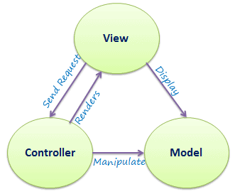
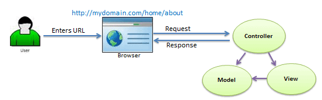
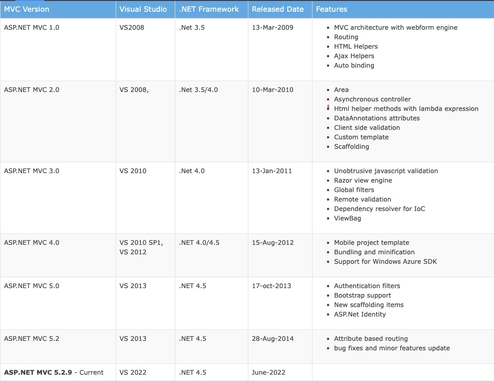
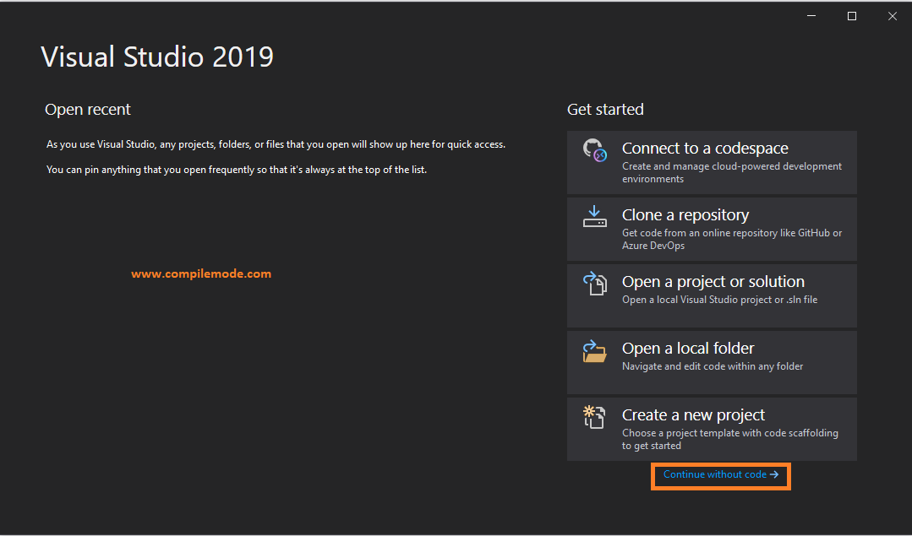
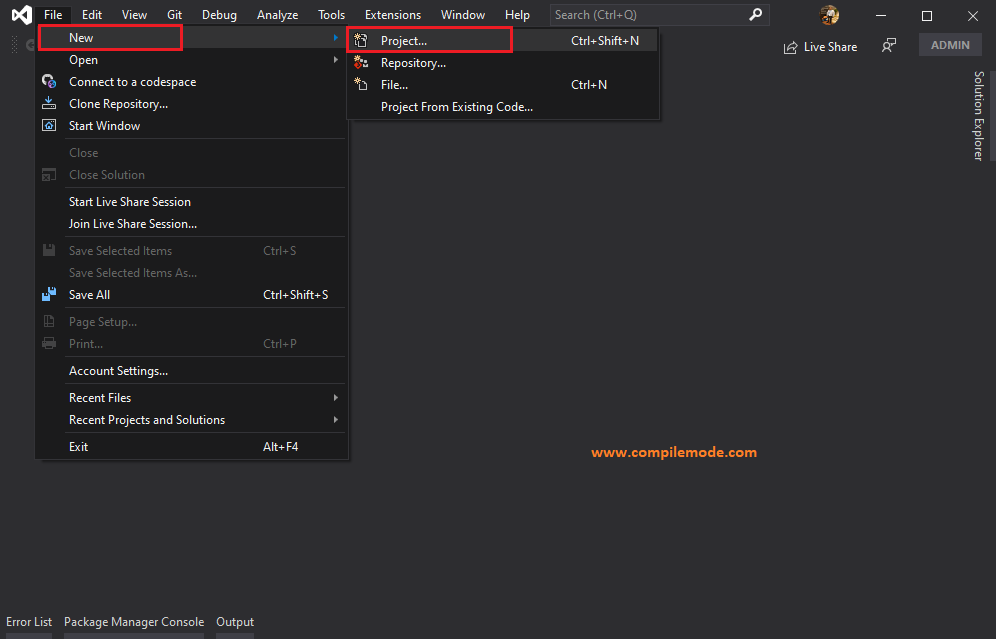
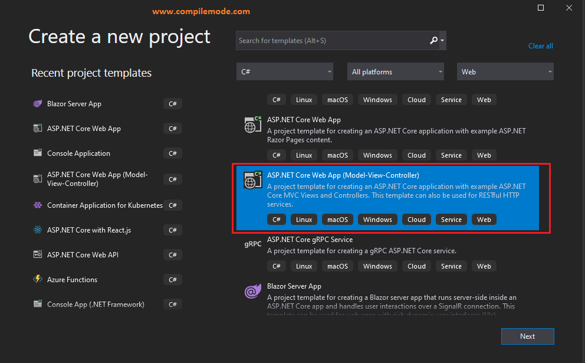
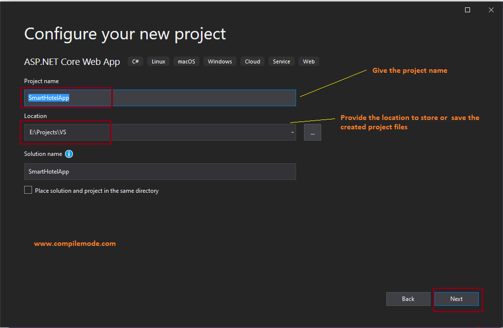
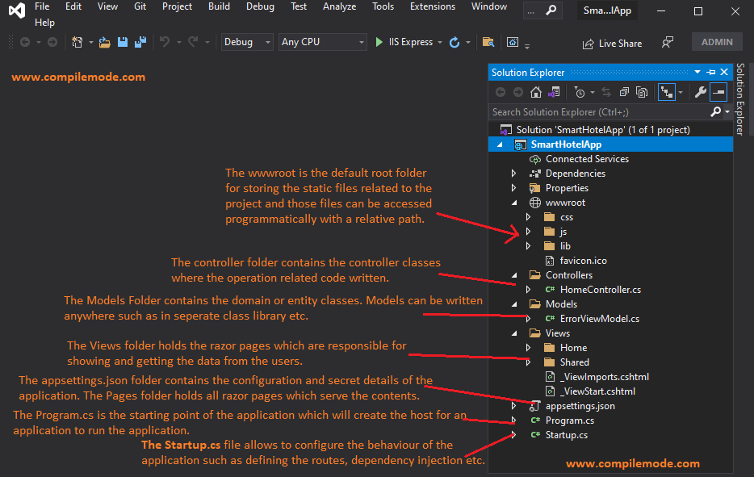
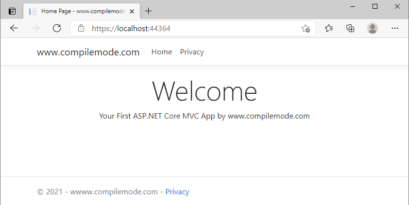
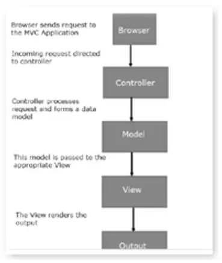

# ASP.NET MVC Architecture
The MVC architectural pattern has existed for a long time in software engineering. All most all the languages use MVC with slight variation, but conceptually it remains the same.

Let's understand the MVC architecture supported in ASP.NET.

MVC stands for Model, View, and Controller. MVC separates an application into three components - Model, View, and Controller.

Model: Model represents the shape of the data. A class in C# is used to describe a model. Model objects store data retrieved from the database.

Model represents the data.

View: View in MVC is a user interface. View display model data to the user and also enables them to modify them. View in ASP.NET MVC is HTML, CSS, and some special syntax (Razor syntax) that makes it easy to communicate with the model and the controller.

View is the User Interface.

Controller: The controller handles the user request. Typically, the user uses the view and raises an HTTP request, which will be handled by the controller. The controller processes the request and returns the appropriate view as a response.

Controller is the request handler.

The following figure illustrates the interaction between Model, View, and Controller.

The following figure illustrates the flow of the user's request in ASP.NET MVC.

As per the above figure, when a user enters a URL in the browser, it goes to the webserver and routed to a controller. A controller executes related view and models for that request and create the response and sends it back to the browser.

## Points to Remember
- MVC stands for Model, View and Controller.
- Model represents the data
- View is the User Interface.
- Controller is the request handler.

# ASP.NET MVC Version History
ASP.NET is a free web framework for building websites and web applications on .NET Framework using HTML, CSS, and JavaScript. ASP.NET MVC 5 is a web framework based on Model-View-Controller (MVC) architecture.

Microsoft had introduced ASP.NET MVC in .NET 3.5, since then lots of new features have been added.

Microsoft made ASP.NET MVC framework open-source in April 2009. The source code was released under the Microsoft Public License (MS-PL). You can view, download, or contribute to the source code on github repository for AspNetWebStack.

The following table list brief history of ASP.NET MVC.

ASP.NET MVC framework can be installed as NuGet package. Visit nuget.org to know details of each version.

In Visual Studio, the latest version of ASP.NET MVC version will be automatically added as a NuGet package when you create a new ASP.NET MVC project. Let's create the first ASP.NET MVC application in the next section.

# What is ASP.NET Core?
 
ASP.NET Core is an open source cross platform framework for developing and building web, cloud, IoT applications.
 
Why should we use ASP.NET Core?
ASP.NET is an open-source platform that runs on Microsoft .NET Core Framework.
We can build and run the ASP.NET core application on a cross platform environment such as Windows, MacOs, Linux etc.
We can build modern apps such as Cloud, IoT, Web apps, mobile backend etc. and those can be easily enabled to run over the cloud platform.
We can host applications on any modern platform such as docker, AKS, or any environment.
Saves the efforts of the developer by built-in features such as dependency injection, you can enable docker, containerization, swagger support in just one click.
Now let's start creating an ASP.NET Core MVC web application.

# Create ASP.NET MVC Application
In this section, we will create a new MVC web application using Visual Studio and understand the basic building blocks of the ASP.NET MVC Application.

We are going to use ASP.NET MVC v5.2, and Visual Studio 2017 community edition, and .NET Framework 4.6 to create our first MVC application.

Download the latest version of Visual Studio from visualstudio.microsoft.com/downloads.

## Step 1 - Open Visual Studio
Open Visual Studio ( I am using 2019)
Once the Visual Studio Opens, Then click on Continue Without Code as shown in the following image

Then from Visual Studio Menu, click on File => New Project, as shown in the following image

Click on the New Project, then the following window appears as shown in step 2.
 
## Step 2 - Choose Project Template
 
You will see the two project templates,
- ASP.NET Core Web App: This project template creates the web application with Razor pages without Model, View, Controller.
- ASP.NET Core Web App (Model-View-Controller): This project template creates the web application with Model, View, Controller (MVC).
Choose the ASP.NET Core Web App(Model-View-Controller) Template as shown in the following image.

After choosing the project template click on Next.
 
## Step 3 - Define Project Name and Location
 
In the project configuration window you will see the following options,
- Project Name
Define any name for your project as per your choice.
- Location
Choose the location to save the project files on your hard drive of the machine. I have chosen the Project/VS folder of the E drive of the machine, and obviously it's different on your computer.
- Solution Name
Solution name is auto-defined based on the project name, but you can change the name based on your own choice.

Additionally, there is a checkbox, if you have checked it, then the solution file (.sln) and project files will be saved in the 
same folder. Now Choose the minimum details for ease of understanding as shown in the following image.

After defining the required details, click on the Next.
 
## Step 4 - Choose the Target Framework
 
Choose the target framework .NET 5 which is the latest or you can choose based on your requirement, skip the other details for ease of understanding as shown in the following image.

.png)

After providing the required details, click the create button. It will create the ASP.NET Core MVC web application as shown in step 5.
 
## Step 5 - Understanding ASP.NET Core MVC Folder Structure 
 
The following is the default folder structure of the ASP.NET Core ASP.NET MVC application.

Let's understand preceding project folder structure in brief.
 
- The wwwroot folder
 
The wwwroot is the default root folder for storing the static files related to the project and those files can be accessed programmatically with a relative path.
 
- Controller Folder
 
The controller folder contains the controller classes where the operation related code written.
 
- Model Folder
 
The Models Folder contains the domain or entity classes. Models can be written anywhere in the solution such as in separate class library or folder etc.
 
- Views Folder
 
The Views folder holds the razor pages which are responsible for showing and getting the data from the users.
 
- The appsettings.json File
 
The appsettings.json folder contains the configuration and secret details of the application.
 
- Program.cs File
 
The Program.cs is the starting point of the application which will create the host for an application to run the application.
 
- Startup.cs File
 
The Startup.cs file allows to configure the behaviour of the application such as defining the routes, dependency injection etc.
 
## Step 6 - Run the ASP.NET Core MVC Application
 
You can run the application with default contents or let open the Index.cshtml file and put some contents there. Now press F5 on the keyboard or use the run option from Visual Studio to run the application in the browser. After running the application, it will show in the browser as shown in the following image.

# Introduction to ASP.NET MVC Architecture
ASP.NET MVC Architecture provides a clean separation of concerns. The entire class and the objects are independent because it is easy to test them separately. The MVC Architecture helps to avoid complexity by separating the application into three units Model, View, and Controller. The MVC framework offers an exchange to ASP.NET Web Form pattern for developing MVC Based Web Applications.

Let’s see the execution flow of the MVC Application when there is a request from the client side.

Let’s see the flow diagram of MVC Architecture:

Initially, the browser sends the request here browser means the client sends the request to the MVC Application. Then the Global.ascx retrieves the request and executes the routing based on the URL of the incoming request by using the RouteTable, RouteData, UrlRoutingModel, and the objects of MVCRouteHandler. Finally, routing operates calls to the appropriate controller and executes them using the IControllerFactory object and the MvcHandler Objects execute method.

The controller processes the data using the Model class and calls up desired methods using the ControllerActionInvoker object. Finally, the processed model passes to the View the User Interface part, which renders the concluding output.
